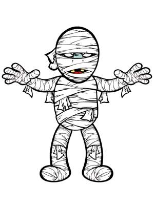
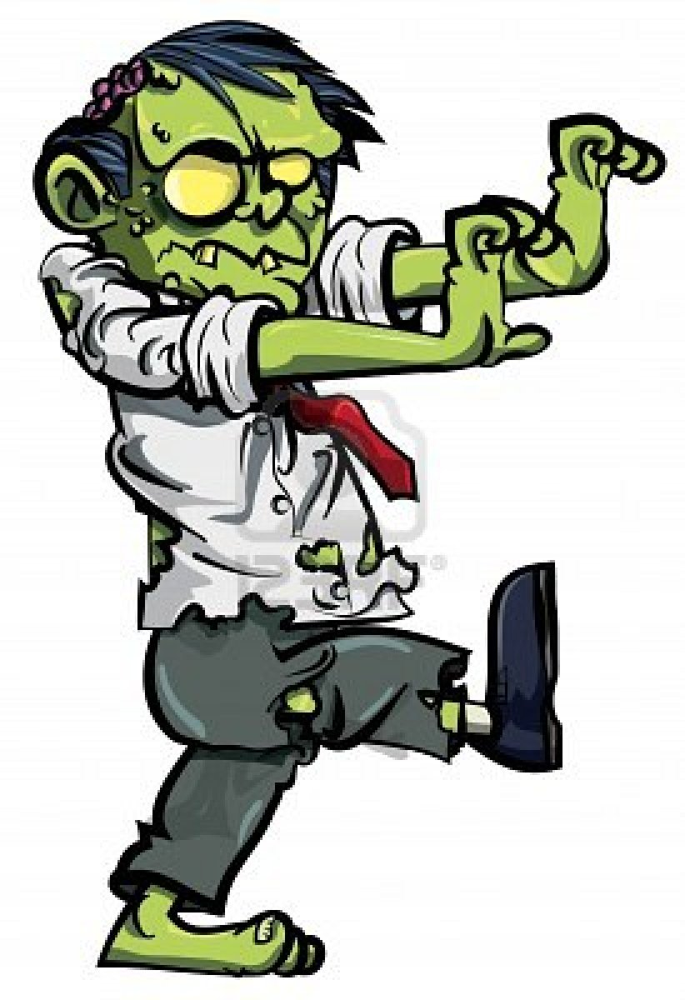
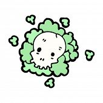
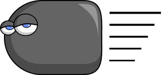
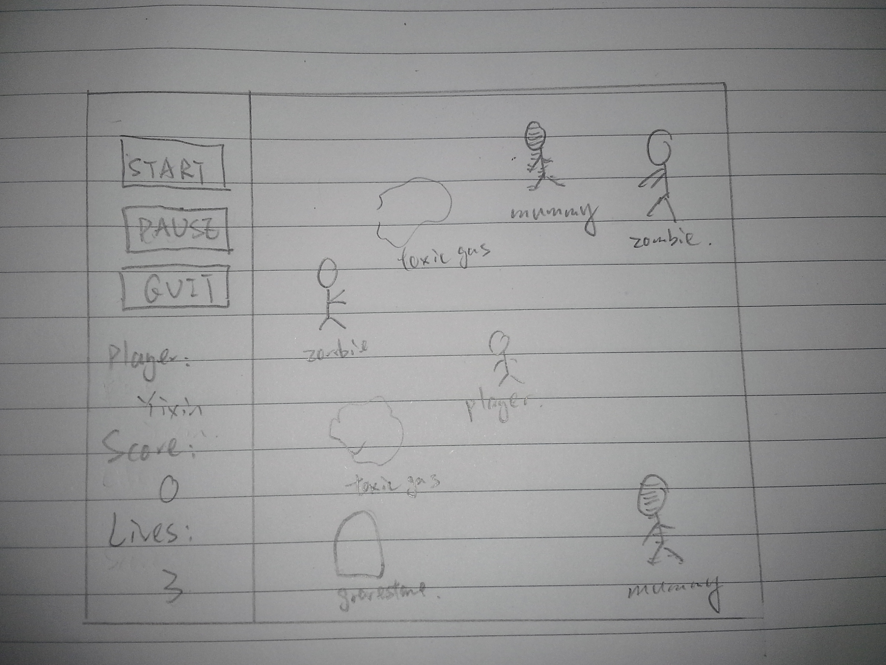

# Game Design Document
This is a place holder for the game design document of Yixin Cai.

----

## Game Description
This is an advanture game.
The player will need to survive from hitting the monsters and gain points from killing them. 

### Things
Things that appear on the screen:
  1. Player: move in eight directions (up, down, right, left, up-right, up-left, down-right, down-left)
  2. [Mummies](mummy_1.jpg): 3HP, appear from the edge of the scene, and move vertically or horizontally with low speed.
  
  
  3. [Zombies](zombie.jpg): 5HP, appear from the edge of the scene, and move randomly with high speed.
  
  
  4. [Gravestones](gravestone.jpg): 7HP, appear randomly on the scene and remain still.
  
  
  5. [Toxic gas cloud](toxic_gas_cloud.jpg): Emitted by zombies and mummies and move randomly.
  
  
  6. [Bullets](bullet.jpg): Emitted by the player and move only horizontally or vertically from.
  
  

### Player control

#### Keyboard
  1. left arrow, right arrow, up arrow, down arrow: control the user to move up/down/left/right
  2. key w,a,s,d: shoot bullets to up, left, down and right respectively.
  
#### Mouse
  click start, pause, quit buttons and buy lifes

### Points
Player starta with 0 points.
Player will get:
  1. 3 points when killing a mummy
  2. 5 points when killing a zombie
  3. 7 points when destructing a gravestone
100 points will be reduced when purchasing an extra life.

### Lifes:
Each player will have 3 lifes initially.
They can buy one extra life with 100 points they have got.
Everytime the player touchs a zombie/mummy/tomb/toxic gas, one life will be lost.
The game is over when the player has no lives any more.

### User interface
The layout is shown as below.

