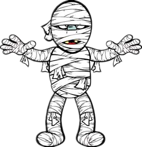
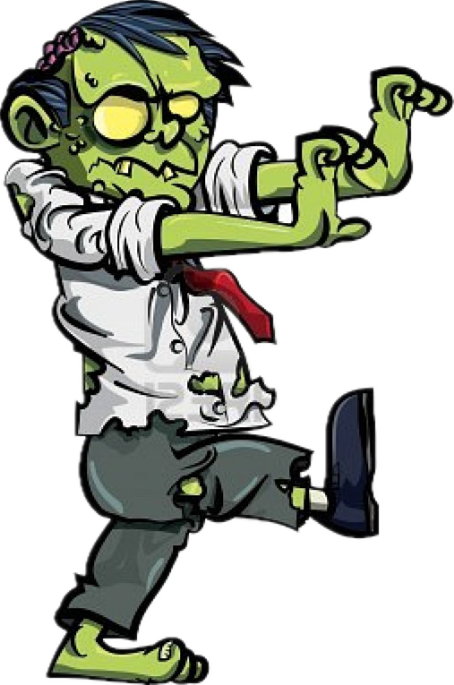
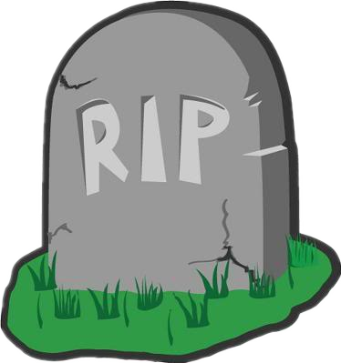
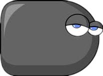

# Game Design Document
This is a place holder for the game design document of Yixin Cai.

----

## Game Description
This is an advanture game.
The player will need to survive from hitting the monsters and gain points from killing them.
There are three levels.

### Things
Things that appear on the screen:
  1. Player: move in eight directions (up, down, right, left, up-right, up-left, down-right, down-left)
  2. [Mummies](mummy_1.png): 1HP, appear from the edge of the scene, and move horizontally in level 1 or follow the player in level 2 and 3, with medium speed.
  
  
  3. [Zombies](zombie.png): 3HP, appear from the edge of the scene, and follow the player with high speed in level 2 and 3.
  
  
  4. [Gravestones](gravestone.png): 5HP, appear randomly on the scene and move horizontally with low speed in all levels.
  
  
  5. [Toxic gas cloud](toxic_gas_cloud.png): Invincible, emitted by zombies, mummies, graves and themselves and move randomly in level 3.
  
  
  6. [Bullets](bullet.png): Emitted by the player and move only horizontally or vertically.
  
  

### Player control

#### Keyboard
  1. key i, k, j, l: control the user to move up/down/left/right.
  2. key w,a,s,d: shoot bullets to up, left, down and right respectively.
  
#### Mouse
  click start, pause, quit buttons
  click the view before pressing keys to move the player

### Points
Player starta with 0 points.
Player will get:
  1 point everytime the bullets hit a zombie/mummy/gravestone/toxic gas. As a result:
  1. Each mummy provides 1 point.
  2. Each zombie provides 3 points.
  3. Each gravestone provides 5 points.
  4. Toxic gas provides infinite points.

### Lifes:
Each player will have 10 lives initially.
Everytime the player touchs a zombie/mummy/gravestone/toxic gas, one life will be lost.
The game is over when the player has no lives any more.

### User interface
The layout is shown as below.

